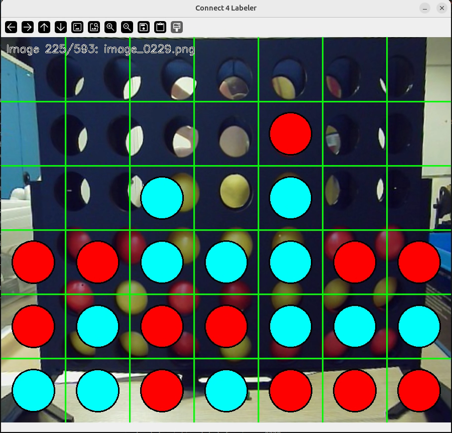
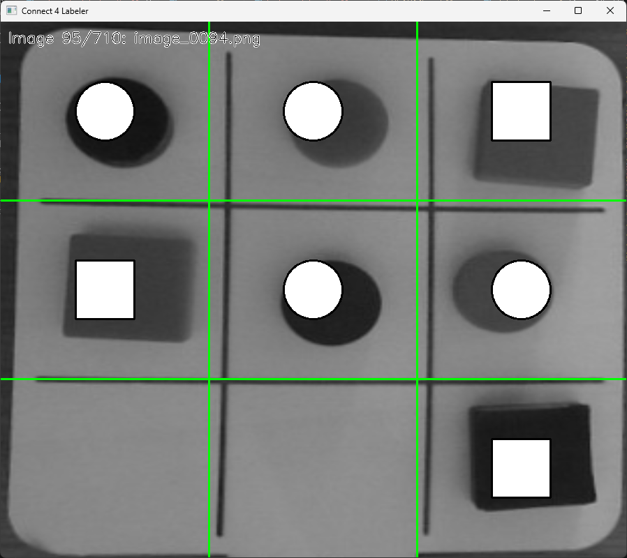
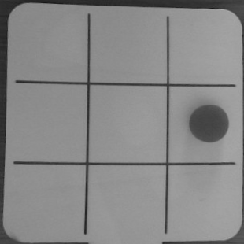
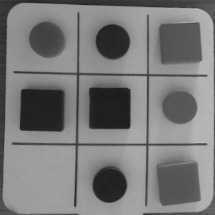
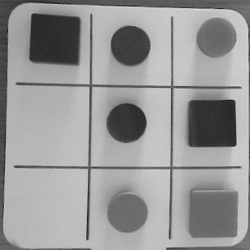
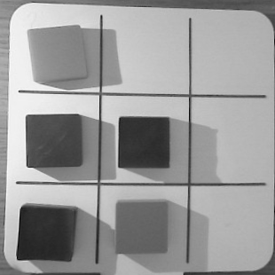
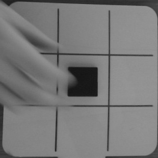
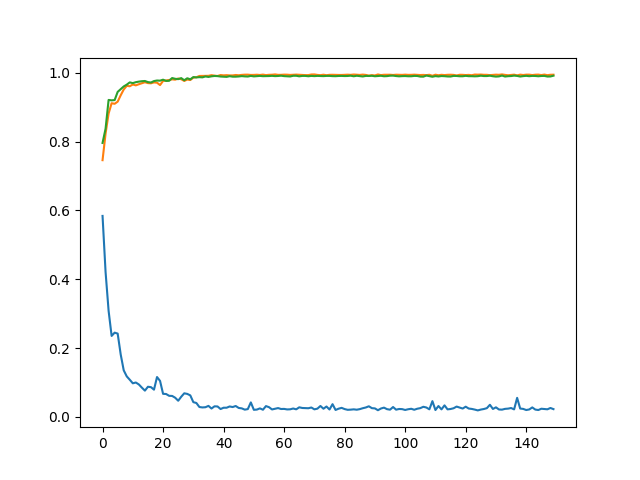
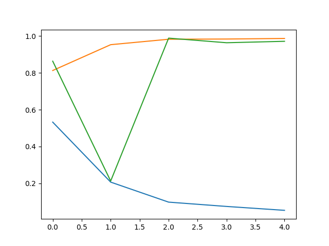

# Ned CNN Detection

Training a FCNN to detect pieces in a tic tac toe / connect 4 board. It's designed as the vision component for a robotic arm (Ned 2) that can play these games against humans.

## Project Overview

This detection system is part of a larger robotic Connect 4 player project. The full robot arm implementation can be found here: [NED Robot Arm Project](https://github.com/SamS709/ned_project)

## Training Process

### 1. Data Collection
Approximately **700 pictures** of game boards were captured in various game states and lighting conditions to create a diverse training dataset.

### 2. Labeling
The `automatic_label.py` tool provides a user-friendly GUI for annotating the boards states in each image:




This interface allows quick and accurate labeling of each cell in the 6x7 Connect 4 grid, marking empty spaces, red pieces, and yellow pieces.

### 4. Model Training
A **Fully Convolutional Neural Network (FCNN)** is trained to detect and classify each position on the board. The model learns to:
- Identify the board grid structure
- Classify each cell as empty, first class or second class piece
- Handle various lighting conditions

Samples of the images:
- For connect 4:


- For tictactoe:







### Training Results




Legend:
- Orange: training accuracy
- Green: validation accuracy
- Blue: loss


## Purpose

This detection system enables a robotic arm to:
1. Visually perceive the current game state
2. Identify valid moves
3. Plan and execute strategic gameplay against human opponents

The complete robotic system integrating this vision module with motion control is available at: [https://github.com/SamS709/ned_project](https://github.com/SamS709/ned_project)

## Usage

### Training
```bash
python main.py
```

### Testing
```bash
python test_model.py
```

### Labeling New Images
```bash
python automatic_label.py
```
